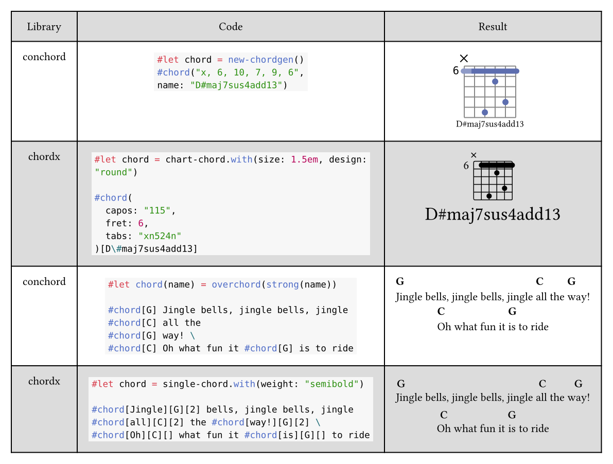

# Conchord

`conchord` (concise chord) is a [typst](https://github.com/typst/typst) package to write lyrics with chords and generate colorful fretboard diagram (aka chord diagram). It is inspired by [chordx](https://github.com/ljgago/typst-chords) package and my previous tiny project for generating chord diagrams SVG-s.

# Overview

`conchord` makes it easy to add new chords, both for diagrams and lyrics. Unlike [chordx](https://github.com/ljgago/typst-chords), you don't need to think about layout and pass lots of arrays for drawing barres. Just pass a string with holded frets and it will work:

```typst
#import "@preview/conchord:0.1.0": new-chordgen, overchord

#let chord = new-chordgen()

#box(chord("x32010", name: "C"))
#box(chord("x33222", name: "F#m/C#"))
#box(chord("x,9,7,8,9,9"))
```


> `x` means closed string, `0` is open, other number is a fret. In case of frets larger than `9` frets should be separated with commas, otherwise you can list them without any separators.

> Chord diagram works like a usual block, so to put them into one line you need to wrap them into boxes. In real code it is recommended to create a wrapper function to customize box margins etc (see larger example below).

It is easy to customize the colors and styles of chords with `colors` argument and `show` rules for text. You can also put `!` and `*` marks in the end of the string to force diagram generation. `!` forces barre, `*` removes it:

```typst
#let custom-chord = new-chordgen(string-number: 3,
    colors: (shadow-barre: orange,
        grid: gray.darken(30%),
        hold: red,
        barre: purple)
)

#set text(fill: purple)
#box(custom-chord("320", name: "C"))
#box(custom-chord("2,4,4,*", name: "Bm"))
#box(custom-chord("2,2,2, *"))
#box(custom-chord("x,3,2, !"))
```


> NOTE: be careful when using **!**, if barre cannot be used, it will result into nonsense.

For lyrics, you don't need to add chord to word and specify the number of char in words (unlike [chordx](https://github.com/ljgago/typst-chords)). Simply add `#overchord` to the place you want a chord. Compose with native Typst stylistic things for non-plain look (you don't need to dig into [chordx](https://github.com/ljgago/typst-chords)'s custom arguments):

```typst
#let och(it) = overchord(strong(it))

=== #raw("[Verse 1]")

#och[Em] Another head 
#och[C] hangs lowly \
#och[G] Child is slowly
#och[D] taken

...
```

> Complete example of lyrics with chords (see [full source](examples/zombie.typ)):


# Features

I was quite amazed with general idea of [chordx](https://github.com/ljgago/typst-chords), but a bit frustated with implementation, so I decided to quickly rewrite my old js code to Typst. I use `cetz` there, so code is quite clean.

> Note: This package doesn't use any piece of [chordx](https://github.com/ljgago/typst-chords), only the general idea is used.

Brief comparison may be seen there, some concepts explained below:



## Think about frets, not layout
Write frets for chord as you hold it, like a string like "123456" (see examples above). You don't need to think about layouting and substracting frets, `conchord` does it for you.

> NOTE: I can't guarantee that will be the best chord layout. Moreover, the logic is quite simple: e.g., barre can't be multiple and can't be put anwhere except first bar in the image. However, surprisingly, it works well in almost all of the common cases, so the exceptions are really rare.

If you need to create something too _custom/complex_ ~~(but not _concise_)~~, maybe it is worth to try [chordx](https://github.com/ljgago/typst-chords). You can also try using core function `render-chord` for more manual control, but it is still limited by one barre starting from one (but that barre may be shifted). If you think that feature should be supported, you can create issue there.

## Shadow barre
Some chord generators put barre only where it _ought to_ be (any less will not hold some strings). Others put it where it can be (sometimes maximal size, sometimes some other logic). I use simple barre where it **ought to** be, and add _shadow barre_ where it **could** maximally be. You can easily disable it by either setting `use-shadow-barre: false` on `new-chordgen` (only necessary part of barre rendered) or by setting color of `shadow-barre` the same as `barre` (maximal possible barre).


## Name auto-scaling
Chord name font size is _reduced_ for _large_ chord names, so the name fits well into chord diagram (see example above). That makes it much more pretty to stack several chords together. To achieve chordx-like behaviour, you can always use `#figure(chord("…"), caption: …)`.

## Easier chords for lyrics
Just add chord labels above lyrics in arbitrary place, don't think about what letter exactly it should be located. By default it aligns the chord label to the left, so it produces pretty results out-of-box. You can pass other alignments to `alignment` argument, or use the chords stright inside words.

The command is _much_ simpler than chordx (of course, it is a trade-off):
```typst
#let overchord(body, align: start, height: 1em, width: -0.25em) = box(place(align, body), height: 1em + height, width: width)
```

Feel free to use it for your purposes outside of the package.

It takes on default `-0.25em` width to remove one adjacent space, so
- To make it work on monospace/other special fonts, you will need to adjust `width` argument. The problem is that I can't `measure` space, but maybe that will be eventually fixed.
- To add chord inside word, you have to add _one_ space, like `wo #chord[Am]rd`.

## Colors

Customize the colors of chord elements. `new-chordgen` accepts the `colors` dictionary with following possible fields:
  - `grid`: color of grid, default is `gray.darken(20%)`
  - `open`: color of circles for open strings, default is `black`
  - `muted`: color of crosses for muted strings, default is `black`
  - `hold`: color of holded positions, default is `#5d6eaf`
  - `barre`: color of main barre part, default is `#5d6eaf`
  - `shadow-barre`: color of "unnecessary" barre part, default is `#5d6eaf.lighten(30%)`

## Assertions

Currently [chordx](https://github.com/ljgago/typst-chords) has almost no checks inside for correctness of passed chords.  `conchord` currently checks for

- Number of passed&parsed frets equal to set string-number
- Only numbers and `x` passed as frets
- All frets fitting in the diagram
