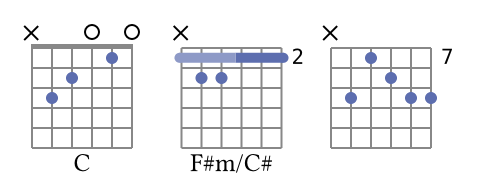
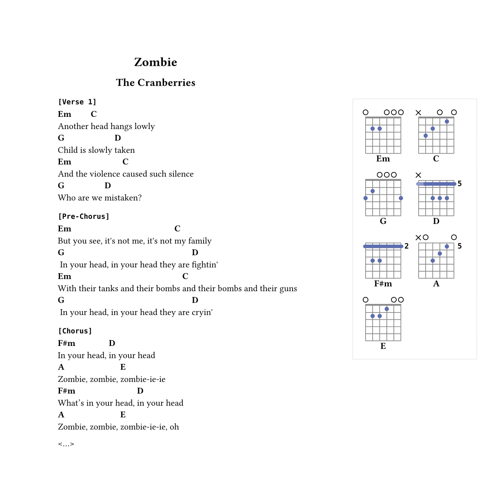
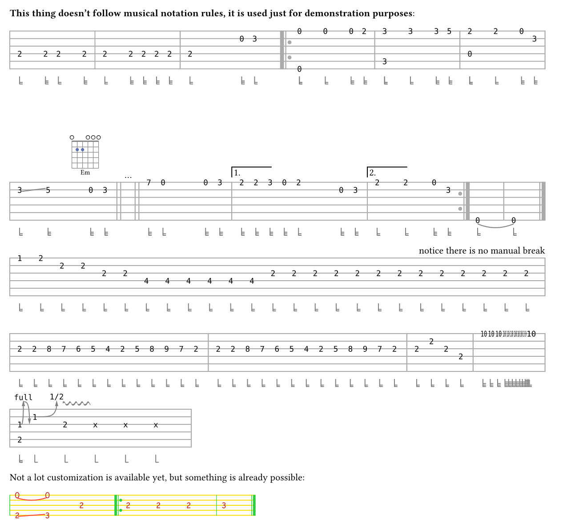

# Conchord
> Notice: I'm preparing the update, so the documentation there is referring to the new version.

`conchord` (concise chord) is a [Typst](https://github.com/typst/typst) package for string instruments.

What can you do with this package?

+ Write up a song with it's chords you liked into Typst format in quite a pretty and simple way.

+ Explore all the possible ways to play some chord with your special tuning of your special string instrument (like ukulele, bass guitar, mandolin or anything else).

  > Conchord embeds a [simple music theory engine](https://github.com/sitandr/conchord-gen) through WASM to interpret chord names and dynamically generate all possible chord tablatures. It also uses some simple heuristics to find the best ones. _Sometimes they may be not the most popular ones._

  > That means conchord doesn't predefine anything, it can come up with any chords for any tuning and instrument!

+ Use this exploration of ways to play a chord to come up with and write up the best way to play your song (very few services allow that). Of course, you can define your own chords without using the engine.

+ Quickly write tabs for your music with compact special tab language. There are still some limitations, but it's possible to write basically anything tab-related with some effort.

+ Easily transpose any part of your songs, change the tuning and instrument and get an instant update of your song chord library (the place where the diagrams are displayed).

+ Write "a book" of compositions with their individual chord libraries.
+ And many more!

# Overview

<!-- toc -->
1. [Conchord](#conchord)
2. [Overview](#overview)
   1. [Chord generation](#chord-generation)
   2. [Chord drawing](#chord-drawing)
3. [Features](#features)
   1. [Think about frets, not layout](#think-about-frets-not-layout)
   2. [Shadow barre](#shadow-barre)
   3. [Name auto-scaling](#name-auto-scaling)
   4. [Easier chords for lyrics](#easier-chords-for-lyrics)
   5. [Colors](#colors)
      1. [Customizing text](#customizing-text)
   6. [Assertions](#assertions)
4. [Tabs](#tabs)
      1. [Duration](#duration)
      2. [Bars and repetitions](#bars-and-repetitions)
      3. [Linebreaks](#linebreaks)
      4. [Ties and slides](#ties-and-slides)
   1. [Bends and vibratos](#bends-and-vibratos)
      1. [Custom content](#custom-content)
      2. [Plans](#plans)

<!-- tocstop -->

## Chord generation

## Chord drawing

`conchord` makes it easy to add new chords, both for diagrams and lyrics. Unlike [chordx](https://github.com/ljgago/typst-chords), you don't need to think about layout and pass lots of arrays for drawing barres. Just pass a string with held frets and it will work:

```typst
#import "@preview/conchord:0.2.0": new-chordgen, overchord

#let chord = new-chordgen()

#box(chord("x32010", name: "C"))
#box(chord("x33222", name: "F#m/C#"))
#box(chord("x,9,7,8,9,9"))
```



> `x` means closed string, `0` is open, other number is a fret. In case of frets larger than `9` frets should be separated with commas, otherwise you can list them without any separators.

> Chord diagram works like a usual block, so to put them into one line you need to wrap them into boxes. In real code it is recommended to create a wrapper function to customize box margins etc (see larger example below).

It is easy to customize the colors and styles of chords with `colors` argument and `show` rules for text. You can also put `!` and `*` marks in the end of the string to force diagram generation. `!` forces barre, `*` removes it:

```typst
#let crazy-chord = new-chordgen(string-number: 3,
    colors: (shadow-barre: orange,
        grid: gray.darken(30%),
        hold: red,
        barre: purple,),
    // bar number displayed to left
    number-to-left: true,
    // disable thick first line when chord played without shift
    thick-nut: false
)

#set text(fill: purple)
#box(crazy-chord("320", name: "C"))
#box(crazy-chord("2,4,4,*", name: "Bm"))
#box(crazy-chord("2,2,2, *"))
#box(crazy-chord("x,3,2, !"))
#box(crazy-chord("12,12,12, !"))
```


> NOTE: be careful when using **!**, if barre cannot be used, it will result into nonsense.

For lyrics, you don't need to add chord to word and specify the number of char in words (unlike [chordx](https://github.com/ljgago/typst-chords)). Simply add `#overchord` to the place you want a chord. Compose with native Typst stylistic things for non-plain look (you don't need to dig into [chordx](https://github.com/ljgago/typst-chords)'s custom arguments):

```typst
#let och(it) = overchord(strong(it))

=== #raw("[Verse 1]")

#och[Em] Another head 
#och[C] hangs lowly \
#och[G] Child is slowly
#och[D] taken

...
```

> Complete example of lyrics with chords (see [full source](examples/zombie.typ)):



# Features

I was quite amazed with general idea of [chordx](https://github.com/ljgago/typst-chords), but a bit frustated with implementation, so I decided to quickly rewrite my old js code to Typst. I use `cetz` there, so code is quite clean.

> Note: This package doesn't use any piece of [chordx](https://github.com/ljgago/typst-chords), only the general idea is taken.

Brief comparison may be seen there, some concepts explained below:


## Think about frets, not layout
Write frets for chord as you hold it, like a string like "123456" (see examples above). You don't need to think about layouting and subtracting frets, `conchord` does it for you.

> NOTE: I can't guarantee that will be the best chord layout. Moreover, the logic is quite simple: e.g., barre can't be multiple and can't be put anywhere except first bar in the image. However, surprisingly, it works well in almost all of the common cases, so the exceptions are really rare.

If you need to create something too _custom/complex_ ~~(but not _concise_)~~, maybe it is worth to try [chordx](https://github.com/ljgago/typst-chords). You can also try using core function `render-chord` for more manual control, but it is still limited by one barre starting from one (but that barre may be shifted). If you think that feature should be supported, you can create issue there.

## Shadow barre
Some chord generators put barre only where it _ought to_ be (any less will not hold some strings). Others put it where it can be (sometimes maximal size, sometimes some other logic). I use simple barre where it **ought to** be, and add _shadow barre_ where it **could** maximally be. You can easily disable it by either setting `use-shadow-barre: false` on `new-chordgen` (only necessary part of barre rendered) or by setting color of `shadow-barre` the same as `barre` (maximal possible barre).


## Name auto-scaling
Chord name font size is _reduced_ for _large_ chord names, so the name fits well into chord diagram (see example above). That makes it much more pretty to stack several chords together. To achieve chordx-like behavior, you can always use `#figure(chord("…"), caption: …)`.

## Easier chords for lyrics
Just add chord labels above lyrics in arbitrary place, don't think about what letter exactly it should be located. By default it aligns the chord label to the left, so it produces pretty results out-of-box. You can pass other alignments to `alignment` argument, or use the chords straight inside words.

The command is _much_ simpler than chordx (of course, it is a trade-off):
```typst
#let overchord(body, align: start, height: 1em, width: -0.25em) = box(place(align, body), height: 1em + height, width: width)
```

Feel free to use it for your purposes outside of the package.

It takes on default `-0.25em` width to remove one adjacent space, so
- To make it work on monospace/other special fonts, you will need to adjust `width` argument. The problem is that I can't `measure` space, but maybe that will be eventually fixed.
- To add chord inside word, you have to add _one_ space, like `wo #chord[Am]rd`.

## Colors

Customize the colors of chord elements. `new-chordgen` accepts the `colors` dictionary with following possible fields:
  - `grid`: color of grid, default is `gray.darken(20%)`
  - `open`: color of circles for open strings, default is `black`
  - `muted`: color of crosses for muted strings, default is `black`
  - `hold`: color of held positions, default is `#5d6eaf`
  - `barre`: color of main barre part, default is `#5d6eaf`
  - `shadow-barre`: color of "unnecessary" barre part, default is `#5d6eaf.lighten(30%)`

### Customizing text

**Important**: _frets_ are rendered using `raw` elements. So if you want to customize their font or color, please use `#show raw: set text(fill: ...)` or similar things.

The chord's name, on the other hand, uses default font, so to set it, just use `#set text(font: ...)` in the corresponding scope.

## Assertions

Currently [chordx](https://github.com/ljgago/typst-chords) has almost no checks inside for correctness of passed chords.  `conchord`, on the other side, checks for

- Number of passed&parsed frets equal to set string-number
- Only numbers and `x` passed as frets
- All frets fitting in the diagram

# Tabs

> Everything there is highly experimental and unstable



```typst
#let chord = new-chordgen(scale-length: 0.6pt)

#let ending(n) = {
    rect(stroke: (left: black, top: black), inset: 0.2em, n + h(3em))
    v(0.5em)
}
*This thing doesn't follow musical notation rules, it is used just for demonstration purposes*:

#tabs.new(```
2/4 2/4-3 2/4-2 2/4-3 |
2/4-2 2/4-3 2/4 2/4 2/4 |
2/4-2 p 0/2-3 3/2-2
|:

0/1+0/6 0/1 0/1-3 2/1 | 3/1+3/5-2 3/1 3/1-3 5/1 | 2/1+0/4-2 2/1 0/1-3 3/2-3 | \ \
3/2-2 `5/2-3
p-2
##
  chord("022000", name: "Em")
##south
0/2-3 3/2 | | ## [...] ## p-4. | | 7/1-3 0/1-2 p-3 0/1 3/1 

##
    ending[1.]
##west

|
2/1-3
2/1
3/1 0/1 2/1-2 p-3 0/2-3 3/2-3
##
  ending[2.]
##west
|
2/1-2 2/1 0/1-3 3/2 :| 0/6-2 | ^0/6-2 || \
1/1 2/1 2/2 2/2 2/3 2/3 4/4 4/4 4/4 4/4 4/4 4/4 2/3 2/3 2/3 2/3  2/3 2/3 2/3 2/3 2/3 2/3 2/3 2/3 2/3
##
[notice there is no manual break]
##east
| 2/3 2/3 8/3 7/3 6/3 5/3 4/3 2/3  5/3 8/3 9/3  7/3 2/3 | 2/3 2/2 2/3 2/4 |
10/1-3 10/1-3 10/1-3 10/1-4 10/1-4 10/1-4 10/1-4 10/1-5. 10/1-5. 10/1-5 10/1-5 10/1-2 \
1/3bfullr+2/5-2 1/2b1/2-1 2/3v-1
```, eval-scope: (chord: chord, ending: ending)
 )


Not a lot customization is available yet, but something is already possible:

#show raw: set text(red.darken(30%), font: "Comic Sans MS")

#tabs.new("0/1+2/5-1 ^0/1+`3/5-2.. 2/3 |: 2/3-1 2/3 2/3 | 3/3 ||",
  scale-length: 0.2cm,
  one-beat-length: 12,
  s-num: 5,
  colors: (
    lines: gradient.linear(yellow, blue),
    bars: green,
    connects: red
  ),
  enable-scale: false
)
```

As you can see from example, you can use raw strings or code blocks to write tabs, there is no real difference.

The general idea is very simple: to write a number on some line, write `<fret number>/<string>`.

**Spaces are important!** All notes and special symbols work well only if properly separated.

### Duration

By default they will be quarter notes. To change that, you have to specify the duration: `<fret>/<string>-<duration>`, where duration is $log_2$ from note duration. So a whole note will be `-0`, a half: `-1` and so on. You can also use as many dots as you want to multiply duration by 1.5, e.g. `-2.`

Once you change the duration, all the following notes will use it, so you have to specify duration every time it is changed (basically, always, but it really depends on composition). Of course, you can just ignore all that duration staff.

### Bars and repetitions

To add simple bar, just add `|`. To add double bar line, use `| |`. To add end movement/composition, add `||`. To add repetitions, use `|:` and `:|` respectively.

### Linebreaks

Notes and bars that don't fit in line will be automatically moved to next. However, sometimes it isn't ideal and may be a bit bugged, so it is recommended to do that manually, using `\`.

The line is autoscaled if it is possible and not too ugly. You can change the maximum and minimum scaling size with `scale-max` and `scale-min`. It is also possible to completely disable scaling with `enable-scale: false`.

### Ties and slides

You can _tie_ notes or _slide_ between them. To use ties, you have to add `^` in front of _second_ tied note, like `1/1 ^3/1`. To use slides you have to do the same, but with \`.

_Current limitation:_ tying and sliding works only on the same string and may work really bad if tied/slided through line break.

## Bends and vibratos

Add `b` after note, but before the duration (e.g. `2/3b-2`) to add a bend. After `b` you can write custom text to be written on top (for example, `b1/2`). Add `r` to the end to add a release.

Adding vibratos works the same way, via adding `v` to the note. The length of vibrato will be the same as the length of the note.

Unfortunately, they are all supported things for now. But wait, there is still one cool thing left!

### Custom content

Add any typst code you want between `## … ##`. It will be rendered with `cetz` on top of the line where you wrote it. That means you can write _lyrics, chords, add complex things like endings_, even **draw the elements that are still missing** (well, it is still worth to create issue there, I will try to do something).

That code is evaluated with `eval`, so you will need to pass dictionary to `eval-scope` with all things you want to use.

You can set align of these elements by writing cetz anchors after the second (e.g., `west`, `south` and their combinations, like `west-south`).

Additionally, if you enjoy drawing missing things, you can also use `preamble` and `extra` arguments in `tabs.new` where you can put any `cetz` inner things (tabs uses canvas, and that allow you drawing on it) before or after the tabs are drawn.

### Plans

1. Add _(optional)_ "rhythm section" under tabs
2. Add more signs&lines
3. Add more built-in things to attach above tabs

It is far from what I want to do, so maybe there will be much more! I will be very glad to receive _any feedback_, both issues and PR-s are very welcome (though I can't promise I will be able to work on it immediately)!
